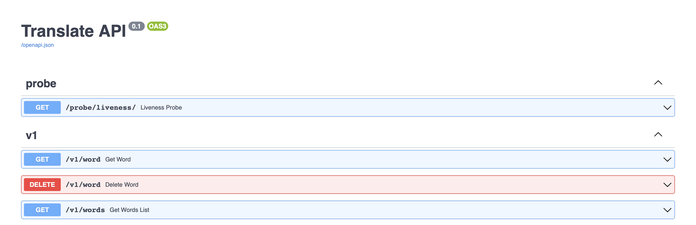

# Translator API
Wrapper for Google Translate based on [Googletrans](https://github.com/ssut/py-googletrans)


## Description
To launch the project on http://localhost:7500/
`docker-compose --env-file ./dev.env up`

All requests are available at http://localhost:7500/docs

### Basic information about requests

```GET /v1/word/?q=[word]&source_code=[code]&target_code=[code]```

**q** - word to translate

**source_code** and **target_code** - languages' codes. List of available languages is in the end of this README


```DELETE /v1/word/?q=[word]&source_code=[code]&target_code=[code]```

**q** - word to delete

**source_code** and **target_code** - languages' codes. List of available languages is in the end of this README


In this version it's required to provide full information about word to delete. So it wouldn't delete  other word's translations.


```GET /v1/words/?q=[word]&source_code=[code]&target_code=[code]&include_translations=[false]&include_definitions=[false]&sorting=1&skip=0&limit=10```

**word** -  word or substring

**source_code** and **target_code** - languages' codes. List of available languages is in the end of this README

**include_translations** and **include_definitions** - booleans to include/exclude additional data. Synonyms are part of the definitions.

**sorting** - can be -1 (Descending) or 1 (Ascending)

**skip** and **limit** - for pagination


It's required to pass at least one of the following params: **word**, **source_code**, **target_code**

---

## Tests
To run tests locally.
1. `docker run -d -p 27017:27017 --name test-mongo mongo:latest`
2. `docker build -t translator-project --target test .`

Now it has 25% coverage cause of conflict between FastAPI's TestClient and Googletrans. But tests for TestClient are written.

---

## Problems and how the can be solved

### Googletrans
- Googletrans could take around 5 attempts to make successful request
- It depends on Google Translate page's content. If Google change something, this library will stop working.
- It has dependencies conflict with FastAPI's TestClient, so it's problematic to write tests.

The best solution is to use Google Translate and Natural Language APIs for this project
Also it is possible to fork Googletrans and fix all this problem.


### Database
I picked MongoDB to make this project faster. But this solution has major issue. Each unique word's translation is stored in the database. Cause of it word's definitions duplicate every time when the same word is translated to a different language.

Posible solutions:
- Store all translations inside one word
- Switch to PostgreSQL and handle every word and definition as unique entities. In this case all words will have relationships and it will require less memory.

---

## List of available languages
```javascript
{'af': 'afrikaans',
 'sq': 'albanian',
 'am': 'amharic',
 'ar': 'arabic',
 'hy': 'armenian',
 'az': 'azerbaijani',
 'eu': 'basque',
 'be': 'belarusian',
 'bn': 'bengali',
 'bs': 'bosnian',
 'bg': 'bulgarian',
 'ca': 'catalan',
 'ceb': 'cebuano',
 'ny': 'chichewa',
 'zh-cn': 'chinese (simplified)',
 'zh-tw': 'chinese (traditional)',
 'co': 'corsican',
 'hr': 'croatian',
 'cs': 'czech',
 'da': 'danish',
 'nl': 'dutch',
 'en': 'english',
 'eo': 'esperanto',
 'et': 'estonian',
 'tl': 'filipino',
 'fi': 'finnish',
 'fr': 'french',
 'fy': 'frisian',
 'gl': 'galician',
 'ka': 'georgian',
 'de': 'german',
 'el': 'greek',
 'gu': 'gujarati',
 'ht': 'haitian creole',
 'ha': 'hausa',
 'haw': 'hawaiian',
 'iw': 'hebrew',
 'he': 'hebrew',
 'hi': 'hindi',
 'hmn': 'hmong',
 'hu': 'hungarian',
 'is': 'icelandic',
 'ig': 'igbo',
 'id': 'indonesian',
 'ga': 'irish',
 'it': 'italian',
 'ja': 'japanese',
 'jw': 'javanese',
 'kn': 'kannada',
 'kk': 'kazakh',
 'km': 'khmer',
 'ko': 'korean',
 'ku': 'kurdish (kurmanji)',
 'ky': 'kyrgyz',
 'lo': 'lao',
 'la': 'latin',
 'lv': 'latvian',
 'lt': 'lithuanian',
 'lb': 'luxembourgish',
 'mk': 'macedonian',
 'mg': 'malagasy',
 'ms': 'malay',
 'ml': 'malayalam',
 'mt': 'maltese',
 'mi': 'maori',
 'mr': 'marathi',
 'mn': 'mongolian',
 'my': 'myanmar (burmese)',
 'ne': 'nepali',
 'no': 'norwegian',
 'or': 'odia',
 'ps': 'pashto',
 'fa': 'persian',
 'pl': 'polish',
 'pt': 'portuguese',
 'pa': 'punjabi',
 'ro': 'romanian',
 'ru': 'russian',
 'sm': 'samoan',
 'gd': 'scots gaelic',
 'sr': 'serbian',
 'st': 'sesotho',
 'sn': 'shona',
 'sd': 'sindhi',
 'si': 'sinhala',
 'sk': 'slovak',
 'sl': 'slovenian',
 'so': 'somali',
 'es': 'spanish',
 'su': 'sundanese',
 'sw': 'swahili',
 'sv': 'swedish',
 'tg': 'tajik',
 'ta': 'tamil',
 'te': 'telugu',
 'th': 'thai',
 'tr': 'turkish',
 'uk': 'ukrainian',
 'ur': 'urdu',
 'ug': 'uyghur',
 'uz': 'uzbek',
 'vi': 'vietnamese',
 'cy': 'welsh',
 'xh': 'xhosa',
 'yi': 'yiddish',
 'yo': 'yoruba',
 'zu': 'zulu'}
```
